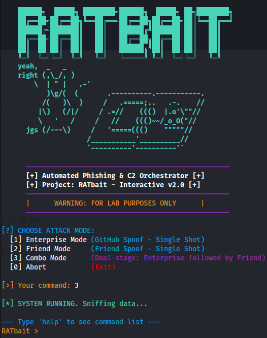
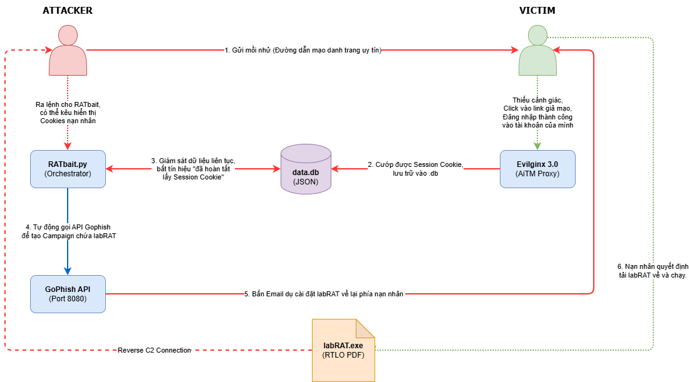

#### ⚠️ Tuyên bố miễn trừ trách nhiệm

Dự án này là một Proof of Concept (PoC) được phát triển cho mục đích giáo dục, nghiên cứu an ninh mạng và thử nghiệm trong môi trường Lab đã được cấp phép. Tác giả không chịu trách nhiệm đối với bất kỳ hành vi lạm dụng, thiệt hại hoặc hoạt động trái pháp luật nào phát sinh từ việc sử dụng dự án này. Việc sử dụng công cụ này trên các hệ thống khi chưa có sự cho phép rõ ràng có thể vi phạm pháp luật nghiêm trọng.
<br>

---

# 🎣 Automated Kill Chain Orchestrator (RATbait)


--- 

## Trải nghiệm Nhanh (System Preview)

Dưới đây là giao diện điều phối (Orchestrator Console) của **RATbait** khi đang lắng nghe dữ liệu từ Evilginx.

<p align="center">
  
</p>

**Bạn muốn xem RATbait lúc chạy mô phỏng sẽ ra sao?**

[👉 Mô phỏng chuỗi tấn công (KILLCHAIN.md)](docs/KILLCHAIN.md)

---

## I. Câu Chuyện Phía Sau (The Backstory & Motivation)

### Khởi nguồn ý tưởng
Từ lâu, Phishing đối với tôi chỉ dừng lại ở những khái niệm cơ bản như "đừng bấm vào link lạ" hay "kiểm tra kỹ người gửi". Tuy nhiên, một ngày nọ, tôi lướt tháy video này **[Russia's Most Wanted Hacker](https://www.youtube.com/watch?v=ZhfI0EboPU0)** liên quan trực tiếp đến **[The Bundestag Hack 2015](https://cyberlaw.ccdcoe.org/wiki/Bundestag_Hack_(2015))** tôi bắt đầu tìm hiểu thêm về các vụ tấn công nhắm vào nhân sự cấp cao (Spear Phishing/Whaling) tôi nhanh chóng nhận ra đây là một lỗ hổng con người cực kỳ nguy hiểm mà mình cần đào sâu nghiên cứu.

**RATbait** ra đời từ sự tò mò đó. Đây cũng là thời điểm thích hợp để tôi kết hợp nó cùng dự án **[labRAT](https://github.com/Lux1dus/LabRAT-C2-Framework)** của mình, tạo nên một chuỗi tấn công (Kill Chain) giả định hoàn chỉnh: từ giây phút nạn nhân nhận email mạo danh cho đến khi Agent chính thức được thực thi trên máy mục tiêu.

### Mục tiêu cá nhân
*   Đào sâu vào cơ chế vận hành của các cuộc tấn công Phishing hiện đại vượt qua MFA.
*   Xây dựng một hệ thống điều phối (Orchestration) có khả năng kết nối các công cụ bảo mật rời rạc.
*   Phát triển tư duy **Purple Team**: Hiểu cách tấn công tự động hóa để thiết kế các phương án phòng thủ hiệu quả hơn.

---

## II. Tổng Quan Dự Án (Project Overview)

### Tóm tắt (Executive Summary)
- **RATbait** là một Framework tự động hóa chuỗi tấn công (Automated Kill Chain), tích hợp Evilginx 3.0 và GoPhish API.

- Hệ thống đóng vai trò là lớp trung gian (Middleware), liên tục giám sát cơ sở dữ liệu của Evilginx. Ngay khi phát hiện nạn nhân mới, nó sẽ tự động trích xuất Session Cookie và kích hoạt các chiến dịch phishing "đạn kép" (Combo Mode) để phân phát mã độc.

- Toàn bộ quy trình từ đánh cắp Token đến thực thi RAT trên máy nạn nhân được tự động hóa, giảm thiểu tối đa thời gian tương tác thủ công của Operator.

### Công nghệ sử dụng (Tech Stack)
Hệ thống kết hợp các công nghệ hàng đầu trong giới Red Team để tạo ra một chuỗi tấn công liên hoàn:

| Thành phần (Component) | Công nghệ (Tech) | Vai trò & Đặc điểm (Role & Features) |
| :--- | :--- | :--- |
| **Orchestrator** | `Python (Threaded)` | "Bộ não" của hệ thống. Giám sát DB, xử lý logic tấn công và điều phối API. |
| **AiTM Engine** | `Evilginx 3.0` | Đóng vai trò Proxy ngược để đánh cắp Session Cookie và vượt MFA. |
| **Phishing API** | `GoPhish` | Quản lý việc gửi email lure, theo dõi lượt click và phân phát tệp thực thi. |
| **RAT Agent** | `Python (labRAT)` | Mã độc điều khiển từ xa, hỗ trợ persistence và lẩn tránh (Safe Mode). |
| **Database** | `JSON` | Lưu trữ dữ liệu nạn nhân, tokens và trạng thái các chiến dịch. |

---

## Khởi động Nhanh (Getting Started - Lab Setup)

[👉 Xem cách cài đặt chi tiết các thành phần khác trước khi chạy RATbait (LAB_SETUP.md)](docs/LAB_SETUP.md)

Để triển khai RATbait trong môi trường Lab (Kali Linux/Debian), hãy thực hiện các bước sau:

### 1. Cài đặt Môi trường
Tải mã nguồn và cài đặt các thư viện phụ thuộc:
```bash
git clone <this repo>
cd RATbait
pip install -r requirements.txt
```

### 2. Cấu hình Biến Môi trường
Tạo file `.env` từ file mẫu và thiết lập các thông số kết nối quan trọng:
```bash
cp .env.example .env
# Sử dụng nano hoặc vim để chỉnh sửa các tham số sau:
```
**Các tham số cần lưu ý trong `.env`:**
*   `GOPHISH_API_KEY`: Lấy từ phần cấu hình tài khoản (Settings) trên giao diện quản trị GoPhish.
*   `EVILGINX_DB_PATH`: Đường dẫn tuyệt đối đến file `data.db` của Evilginx (thông thường là `/root/.evilginx/data.db`).
*   `C2_SERVER_URL`: Địa chỉ IP của máy chủ lắng nghe kết nối từ mã độc (labRAT).
*   `PAYLOAD_URL`: Đường dẫn tải file mã độc mồi nhử (được hiển thị trong email phishing).

### 3. Hiệu chỉnh RATbait.py (Nếu cần)
Mở file `RATbait.py`, kiểm tra các biến cấu hình mặc định ở đầu file để đảm bảo chúng khớp với môi trường Lab của bạn (ví dụ: Cấu hình SMTP và Template mặc định).

### 3. Kích hoạt Nhạc trưởng
Khởi chạy Orchestrator với quyền root (để đọc DB Evilginx):
```bash
sudo python3 RATbait.py
```
*Sau khi chạy, bạn có thể chọn chế độ tấn công (Enterprise, Friend hoặc Combo) ngay trên giao diện CLI.*

---


### Quy Trình Hoạt Động (Workflow)
Hệ thống **RATbait** vận hành theo một chuỗi tấn công tự động hóa bao gồm 6 bước khép kín:

<p align="center">
  
</p>

| Bước | Giai đoạn (Phase) | Công cụ | Mô tả chi tiết (Description) |
| :---: | :--- | :---: | :--- |
| **1** | **Initial Lure**<br>*(Gửi mồi nhử)* | `Attacker` | Kẻ tấn công khởi xướng bằng cách gửi đường dẫn mạo danh trang đăng nhập uy tín. Nạn nhân truy cập và tiến hành đăng nhập. |
| **2** | **AiTM Harvesting**<br>*(Đánh cắp phiên)* | `Evilginx 3.0` | Hoạt động như Reverse Proxy, thu thập `Username/Password`, vượt qua xác thực MFA và cướp trọn **Session Cookie**, lưu vào `data.db`. |
| **3** | **Continuous Sniffing**<br>*(Giám sát & Trích xuất)* | 🧠 `RATbait` | Liên tục giám sát `data.db`. Ngay khi có Session Cookie mới, hệ thống tự động trích xuất thông tin.<br><br> *> Hỗ trợ CLI để Operator trích xuất nhanh Cookie phục vụ Pass-the-Cookie.* |
| **4** | **Automated Orchestration**<br>*(Điều phối chiến dịch)* | `RATbait`<br> `GoPhish API` | Dựa trên dữ liệu thu thập được, RATbait tự động gọi API của GoPhish để khởi tạo chiến dịch tấn công bồi (giai đoạn 2) vào email nạn nhân. |
| **5** | **Payload Delivery**<br>*(Phân phát mã độc)* | `GoPhish` | Gửi email thao túng tâm lý (vd: cảnh báo bảo mật). File đính kèm là `labRAT.exe` nhưng được ngụy trang thành tài liệu (PDF/DOCX) bằng **RTLO**. |
| **6** | **Execution & Reverse C2**<br>*(Thực thi & Kiểm soát)* | `labRAT` | Nạn nhân tải và chạy file đính kèm. Mã độc kích hoạt ngầm, tạo kết nối đảo (Reverse C2). Attacker có **quyền kiểm soát toàn diện** thiết bị. |
## III. Kiến Trúc Điều Phối & API (Orchestration & API Flow)

Hệ thống RATbait được thiết kế dựa trên mô hình **Asynchronous Multi-threading** (Đa luồng bất đồng bộ), đảm bảo việc giám sát dữ liệu diễn ra liên tục theo thời gian thực mà không làm gián đoạn trải nghiệm điều khiển thủ công của Operator.

### 1. Mô hình Đa Luồng (Dual-Thread Architecture)
| Luồng xử lý | Tên hàm (Function) | Kỹ thuật cốt lõi (Core Tech) | Nhiệm vụ chính |
| :--- | :--- | :--- | :--- |
| **Daemon Thread**<br>*(Chạy nền)* | `sniffer_thread()` | `File I/O Polling` &<br>`Regex Parsing` | Liên tục đọc đuôi (tail) file `data.db` của Evilginx. Sử dụng Regex để truy xuất nhanh thông tin đăng nhập (`username/password`) ngay khi nạn nhân vừa submit. |
| **Main Thread**<br>*(Chạy nổi)* | `interactive_console()` | `CLI Input Loop` &<br>`JSON Processing` | Cung cấp giao diện tương tác Cyberpunk. Cho phép Operator gõ lệnh (vd: `show cookies <email>`). Luồng này sẽ parse cấu trúc JSON phức tạp để lọc ra chính xác Session Token. |

### 2. Luồng gọi API & Logic "Đạn kép" (GoPhish API Flow)
Thay vì cấu hình chiến dịch thủ công, luồng `trigger_payloads()` sẽ tự động hóa hoàn toàn quy trình tương tác với GoPhish API qua các bước:

1. **Target Generation (`POST /api/groups`)**: Tự động tạo một nhóm mục tiêu mới (Group) chứa duy nhất email của nạn nhân vừa sập bẫy.
2. **Campaign Launch (`POST /api/campaigns`)**: Kết hợp Group vừa tạo với các Mẫu email (Template) và Cấu hình gửi (SMTP) có sẵn để phát động chiến dịch.
3. **Combo Mode Logic**: Nếu Operator chọn chế độ số 3 (Combo Mode), hệ thống sẽ thực thi thuật toán **Tấn công bồi**:

   - Bắn API chiến dịch 1 (Enterprise Lure).
   - Tạm dừng chính xác `30 giây` (`time.sleep(30)`) để tạo độ trễ tự nhiên (Natural Delay), tránh các bộ lọc thư rác (Spam Filters).
   - Tiếp tục bắn API chiến dịch 2 (Friend Lure) để tăng tối đa tỉ lệ nạn nhân click vào Payload.

---

## IV. Các Điểm Hạn Chế & Rủi Ro (Current Limitations)

Mặc dù là một Framework mạnh mẽ, **RATbait** hiện tại vẫn có những điểm giới hạn về mặt kiến trúc cần lưu ý:

| Nhược điểm (Limitation) | Nguyên nhân kỹ thuật | Rủi ro (Risk) |
| :--- | :--- | :--- |
| **Local DB Dependency** | Yêu cầu quyền truy cập đọc trực tiếp vào file `data.db` của Evilginx trên cùng một Server. | Khó triển khai trong kiến trúc phân tán (Server C2 và Phishing tách biệt). |
| **Unproxied API Calls** | Các request gọi tới GoPhish API (Port 3333) hiện đang được gửi trực tiếp không qua bọc (Proxy). | Traffic có thể bị Blue Team bắt được, dẫn tới việc C2 IP bị đưa vào Blacklist. |
| **Plaintext Token Exposure** | Session Cookies trích xuất ra được hiển thị dạng bản rõ (Plaintext) trên Terminal của Operator. | Rủi ro rò rỉ Token nhạy cảm qua màn hình/log nếu máy điều khiển bị giám sát. |

---

## V. Lộ Trình Phát Triển (Future Roadmap)

Định hướng nâng cấp RATbait thành một hệ thống C2 Orchestrator phân tán và thông minh hơn:

| Giai đoạn | Module Nâng cấp | Mô tả chi tiết & Mục tiêu |
| :---: | :--- | :--- |
| **Phase 2** | **Remote DB Support** | Hỗ trợ đọc dữ liệu từ Evilginx Server từ xa thông qua giao thức SSH hoặc gRPC. |
| **Phase 3** | **C2 Notification Integrations**| Tích hợp bot thông báo nạn nhân mới sập bẫy trực tiếp qua Telegram hoặc Discord. |
| **Phase 4** | **Generative AI Lures** | Sử dụng LLM (GPT API) để tự động phân tích ngữ cảnh và soạn nội dung email phishing cá nhân hóa. |
| **Phase 5** | **Payload Evasion** | Tích hợp bộ mã hóa động (Dynamic Encoders) cho `labRAT` để qua mặt các hệ thống EDR hiện đại khi phân phát. |

---

## VI. Những kiến thức mới (Key Learnings & Concepts)

Trong quá trình xây dựng **RATbait**, dự án đã giúp củng cố các tư duy phòng thủ và tấn công nâng cao:

| Kiến thức | Chi tiết kỹ thuật & Ứng dụng |
| :--- | :--- |
| **AiTM Automation** | Hiểu sâu sắc cơ chế đánh cắp và thao tác trực tiếp trên Session Tokens để vượt qua các rào cản MFA. |
| **Security Orchestration** | Nắm vững cách liên kết các công cụ bảo mật rời rạc (Evilginx, GoPhish) thông qua API để tạo thành một chuỗi cung ứng tấn công (Kill Chain) liền mạch. |
| **Real-time Processing** | Ứng dụng kỹ thuật đa luồng (Multi-threading) và I/O Polling để xử lý dữ liệu lớn theo thời gian thực mà không làm treo ứng dụng. |
| **Social Engineering** | Áp dụng thành công kỹ thuật "Double-dip" (Tấn công bồi đạn kép) giúp tối đa hóa tỷ lệ lừa đảo thành công. |

---

<p align="center">
  <b>Made with 💻 and ☕ by <a href="https://github.com/Lux1dus">Lux1dus</a></b>
</p>
