# 🚀 Quy Trình Mô Phỏng Chuỗi Tấn Công (Kill Chain)

Tài liệu này trình bày chi tiết các giai đoạn thực hiện một kịch bản tấn công mô phỏng hoàn chỉnh, từ bước tiếp cận ban đầu đến khi kiểm soát hoàn toàn hệ thống thông qua Framework **RATbait**.

---

## 0. Điều Kiện Tiền Đề (Prerequisites)

Trước khi khởi động chiến dịch, hạ tầng Lab cần được cấu hình sẵn sàng:

1.  **Hệ thống:** Hoàn tất thiết lập Root CA, chứng chỉ TLS và cấu hình phân giải tên miền (Hostname) trên máy trạm.
2.  **Dịch vụ chặn thu:** Kích hoạt **MailHog** để giám sát và thu thập các email mô phỏng trong môi trường nội bộ.
3.  **Nền tảng Phishing:** Khởi động **GoPhish** và truy cập vào giao diện quản trị Web UI.
4.  **Công cụ AiTM:** Chạy **Evilginx** ở chế độ nhà phát triển (`--developer`).

---

## Giai Đoạn 1: Thiết Lập Mồi Nhử (Initial Lure)

Mục tiêu của giai đoạn này là tạo ra một trang đăng nhập giả mạo có khả năng đánh lừa người dùng và vượt qua các cơ chế bảo mật.

1.  **Cấu hình Phishlet:** Thiết lập cấu hình cho mục tiêu cụ thể (ví dụ: `github`) bằng cách nạp file định dạng `.yaml` vào thư mục cấu hình của Evilginx.
2.  **Khởi tạo đường dẫn dụ dỗ (Lure URL):** Sau khi cấu hình hoàn tất, hệ thống sẽ sinh ra một đường dẫn giả mạo trang đăng nhập hợp lệ.

  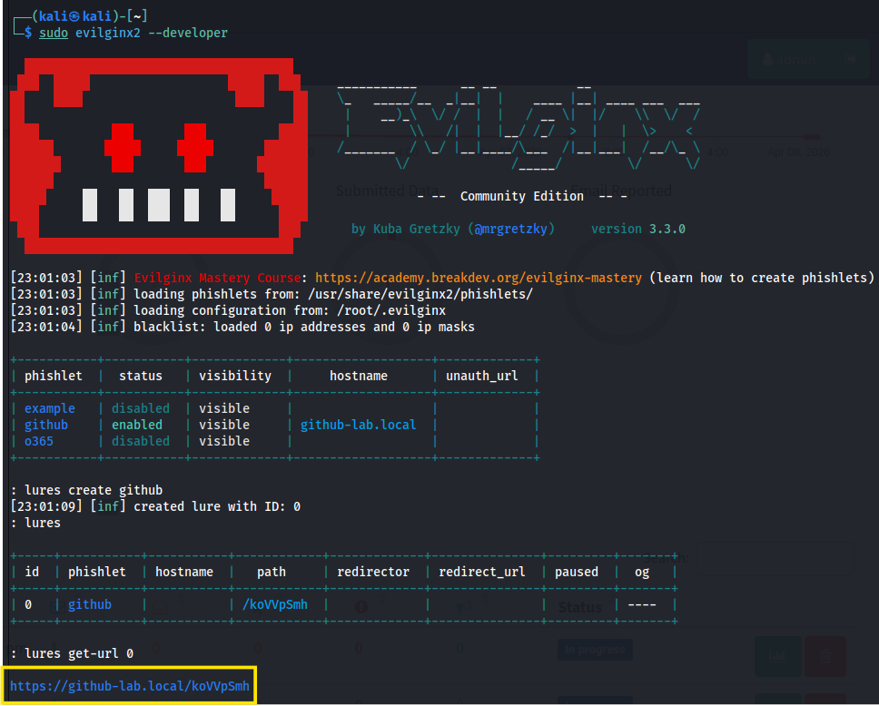

3.  **Phát động chiến dịch:** Nhúng đường dẫn mồi nhử vào mẫu email (Email Template) trên GoPhish và gửi tới danh sách mục tiêu từ tệp `dataset/targets.csv`.

- Hệ thống giám sát **MailHog** sẽ xác nhận việc gửi email thành công:

  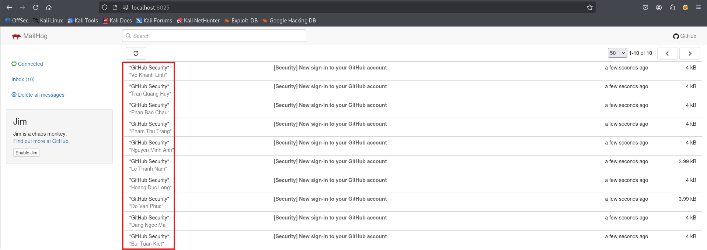

- Giao diện email mồi nhử dưới góc nhìn của nạn nhân:

  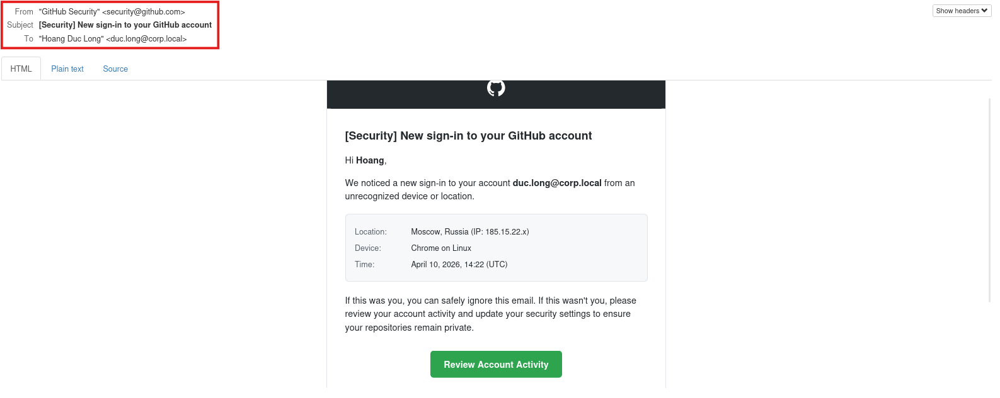

---

## Giai Đoạn 2: Đánh Cắp Phiên Đăng Nhập (AiTM Harvesting)

Đây là giai đoạn then chốt sử dụng kỹ thuật Tấn công ở giữa (Adversary-in-the-Middle) để chiếm đoạt tài khoản mà không cần phá mã MFA.

1.  **Kích hoạt RATbait:** Khởi chạy trình điều phối bằng lệnh `sudo python3 RATbait.py` và lựa chọn chế độ tấn công (ví dụ: **Combo Mode**).

  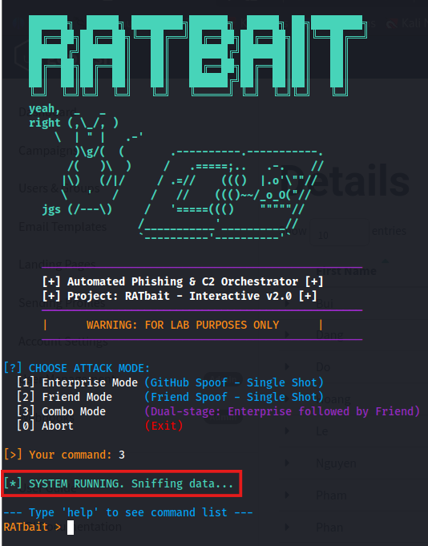

2.  **Thu thập dữ liệu:** Khi nạn nhân truy cập trang giả mạo và thực hiện đăng nhập, Evilginx đóng vai trò là Proxy ngược để thu thập thông tin và mã xác thực.

  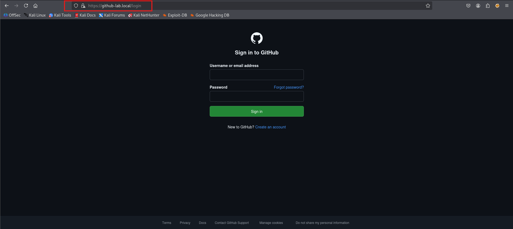

3.  **Trích xuất mã định danh (Session Cookies):** Ngay khi nạn nhân hoàn tất xác thực hai lớp (MFA), Evilginx sẽ chiếm hữu phiên đăng nhập hợp lệ và ghi lại vào cơ sở dữ liệu `data.db`.

  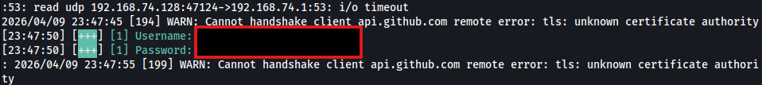

4.  **Khai thác phiên đăng nhập:** Thông qua RATbait, ta có thể trích xuất chính xác Cookie bằng lệnh `show cookies <email_nạn_nhân>`. Sử dụng các công cụ như "Cookie-Editor" để nạp mã định danh này vào trình duyệt, ta sẽ chính thức chiếm quyền điều khiển tài khoản mà không cần mật khẩu hay mã OTP.

  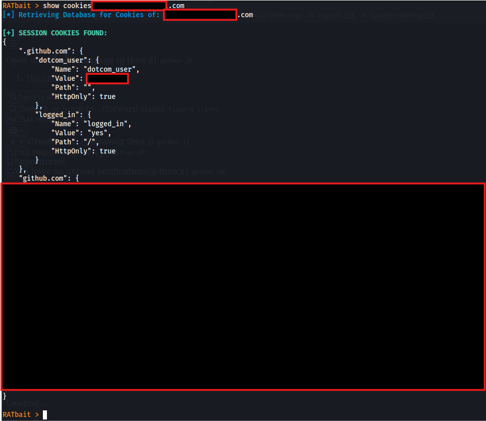

---

## Giai Đoạn 3: Điều Phối Tấn Công Tự Động (Orchestration)

Sau khi có được quyền truy cập tài khoản, **RATbait** sẽ tự động hóa các bước tiếp theo để phân phát mã độc (Payload).

1.  **Tấn công bồi (Follow-up Attack):** Dựa trên cấu hình đã chọn, RATbait gọi API của GoPhish để phát động chiến dịch thứ hai nhắm trực tiếp vào nạn nhân vừa sập bẫy.
2.  **Chiến thuật "Đạn kép" (Combo Mode):**
    *   **Email 1 (Doanh nghiệp):** Gửi thông báo bảo mật hệ thống, yêu cầu nạn nhân thực thi tệp kiểm tra (thực chất là mã độc `labRAT.exe`).
    *   **Email 2 (Cá nhân):** Được gửi tự động sau 30 giây dưới danh nghĩa một đồng nghiệp hoặc bạn bè để xác nhận, nhằm gia tăng tối đa sự tin tưởng.

**⚠️ Lưu ý:** Trong môi trường Lab, tôi sử dụng Gmail cá nhân làm nguồn gửi hợp lệ để đảm bảo email vượt qua được các bộ lọc bảo mật như SPF hay DKIM.

  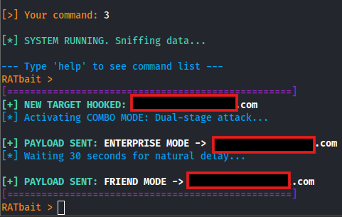

- Minh họa giao diện email giả mạo tổ chức và cá nhân gửi tới nạn nhân:

| Chế độ Doanh nghiệp (Enterprise) | Chế độ Bạn bè (Friend) |
| :---: | :---: |
| 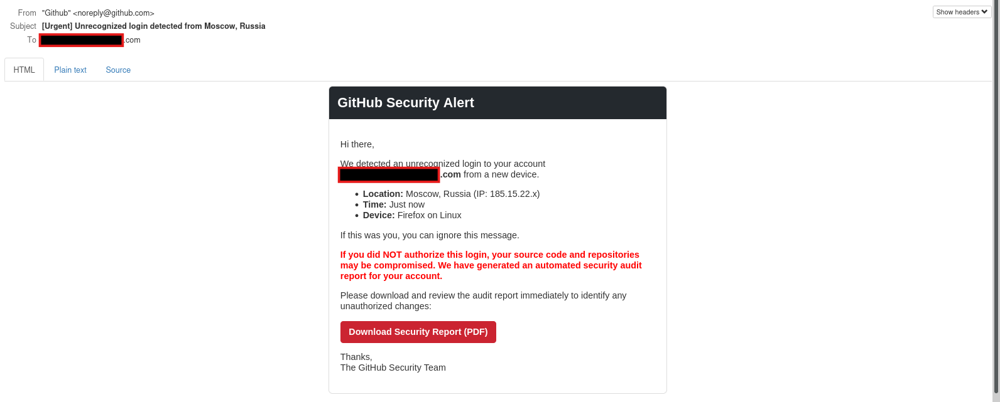 | 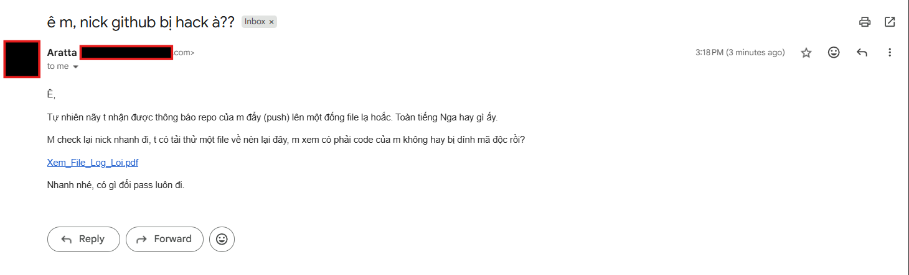 |

---

## Giai Đoạn 4: Kiểm Soát Và Duy Trì (Post-Exploitation)

Giai đoạn cuối cùng của chuỗi tấn công, khi mã độc được thực thi và kẻ tấn công chính thức kiểm soát thiết bị.

1.  **Thực thi mã độc:** Giả định nạn nhân vì tâm lý lo lắng đã tải xuống và kích hoạt tệp đính kèm trên máy trạm Windows.
2.  **Kết nối ngược (Reverse C2):** Mã độc `labRAT.exe` khởi chạy ngầm, gửi tín hiệu kiểm tra (Check-in) về máy chủ điều khiển.
3.  **Quản trị mục tiêu:** Thông qua giao diện dòng lệnh của `labRAT`, ta có thể thực thi lệnh từ xa, theo dõi tài nguyên hệ thống và thiết lập các cơ chế duy trì quyền truy cập lâu dài (Persistence).

  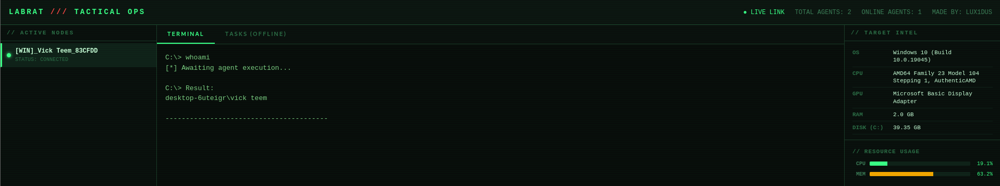

---

## Kết Luận

Chuỗi tấn công mô phỏng đã hoàn tất thành công, minh chứng cho sự nguy hiểm của các kỹ thuật tấn công kết hợp giữa AiTM và kỹ nghệ xã hội (Social Engineering) tự động hóa.

**Điều hướng hệ thống:**
[🏠 Trang chủ](../README.md) | [⚙️ Thiết lập Lab](LAB_SETUP.md) | [🌐 Lý thuyết Hạ tầng](INFRA_THEORY.md) | **[🚀 Quy trình Demo](KILLCHAIN.md)**
